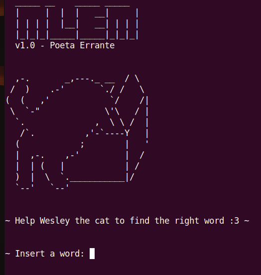
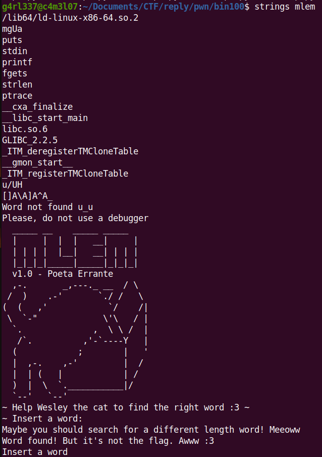
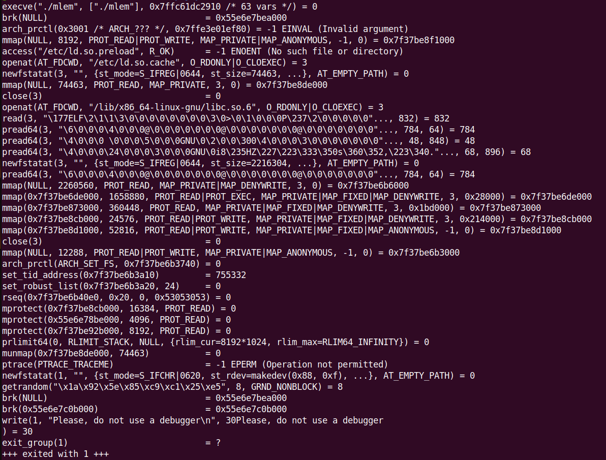
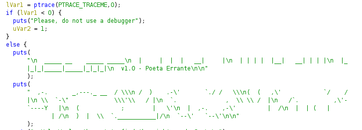
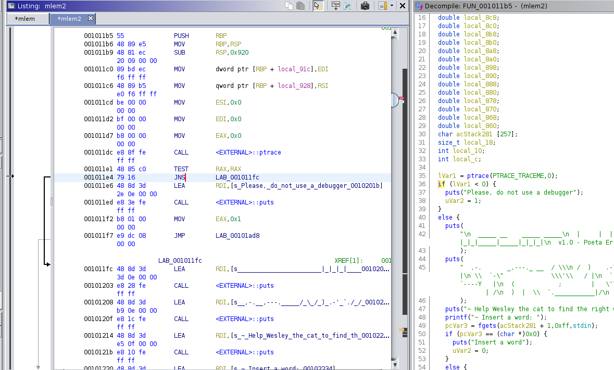
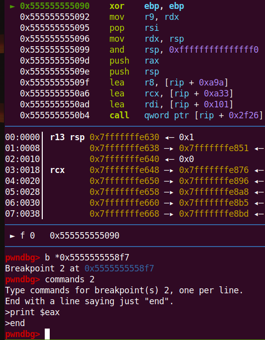

# Binary 100

mlem is a ELF 64 bit stripped executable with PIE.

The workflow is quite simple: the program asks for a string in input and then output a message depending on how this string is formed.



Checking the lenght, and presumably, each character of the string, this kind of challenge is to find an input that match each constraint.


With strings I can assume that, even if we find such string, the flag will be elsewhere.



Even worse the program has some anti-debugging check:




In order to analyse better the binary I opened it with ghidra.

The next step was to search the string just appeared in the strace command. 
Here I found also the function that contains the ptrace check and all the checks for the input. 



Therefore I decided to bypass ptrace checks patching a binary instructions, substituting the JNS instruction with JMP and save the new binary.



With the new exported executable I am now able to use gdb or other debugger tools.
However, before digging into the binary, I copied all the checks made by the program in order to use a SAT solver to discover which string fulfilled all the below conditions:

```
        if (local_8a0 == 91.0) {
          if (local_888 == 91.0) {
            if (local_918[0] + local_918[0] + 11.0 == local_918[0] + 130.0) {
              if (local_860 + local_860 + 6.0 == local_860 + 127.0) {
                if (local_918[1] * 7.0 == local_918[1] + 396.0) {
                  if (local_868 == 104.0) {
                    if ((local_918[2] + 2.0) * 3.0 - 2.0 == (local_918[2] - 17.0) * 4.0) {
                      if (local_870 == (local_870 + local_870) - 44.0) {
                        if (local_918[3] == 67.0) {
                          if ((local_878 * 3.0 - 2.0) * 3.0 - (local_878 * 5.0 + 2.0) * 4.0 == local_878 * -8.0 - 146.0) {
                            if ((local_8f8 * 5.0 - 2.0) * 5.0 - (local_8f8 + local_8f8 + 7.0) * 6.0== local_8f8 * 33.0 - 1132.  0) {
                              if (local_880 == (local_918[3] + local_878) - 16.0) {
                                if ((local_8f0 + local_8f0) / 3.0 == (local_8f0 + 44.0) / 3.0) {
                                  if (local_890 == 49.0) {
                                    if ((local_8e8 * 8.0 + 15.0) * 0.1666666666666667 ==(local_8e8 + local_8e8 + 81.0) * 0.5) {
                                      if (0.0 - local_898 / 5.0 == 36.0 - local_898) {
                                        if ((local_8e0 * 7.0) / 2.0 == local_8e0 * 3.0 + 23.5) {
                                          if (local_8a8 == local_8a8 / 2.0 + 48.0) {
                                            if (local_8d8 == 110.0) {
                                              if (local_8b0 == local_8a8 / 2.0 - 1.0) {
                                                if (local_8d0 == 104.0) {
                                                  if ((local_8b8 == local_8c0) && (local_8c0 == 108.0)) {
                                                    if (local_8c8 == 48.0) {
							\\ ....

```


For all the above conditions I used [Z3](./script/zsol.py) to search for the valid ASCII code for each character (declared as double):

```
  double local_918 [4];
  double local_8f8;
  double local_8f0;
  double local_8e8;
  double local_8e0;
  double local_8d8;
  double local_8d0;
  double local_8c8;
  double local_8c0;
  double local_8b8;
  double local_8b0;
  double local_8a8;
  double local_8a0;
  double local_898;
  double local_890;
  double local_888;
  double local_880;
  double local_878;
  double local_870;
  double local_868;
  double local_860;
```

Here is the output of Z3 script:

```
[local_888 = 91,
 local_8a0 = 91,
 local_8f0 = 44,
 local_8e8 = 126666666666666665/1111111111111112,
 local_868 = 104,
 local_8b0 = 47,
 local_890 = 49,
 local_8d0 = 104,
 local_880 = 95,
 local_898 = 45,
 local_860 = 121,
 local_878 = 44,
 local_8e0 = 47,
 local_8d8 = 110,
 local_8b8 = 108,
 local_921 = 67,
 local_870 = 44,
 local_920 = 72,
 local_919 = 66,
 local_8a8 = 96,
 local_8c8 = 48,
 local_8f8 = 54,
 local_8c0 = 108,
 local_918 = 119]
```

For local_8e8 only the integer part is considered, which is 113.

Finally, the last thing to do was to find the right order of each string's character.
The memory addresses order was decreasing. Moreover, for the first 4 characters (since they are in an array), the order is reversed:

So the final layout will be:

```
'0x918',
'0x919',
'0x920',
'0x921', 
'0x8f8', 
'0x8f0', 
'0x8e8', 
'0x8e0', 
'0x8d8', 
'0x8d0', 
'0x8c8', 
'0x8c0', 
'0x8b8', 
'0x8b0', 
'0x8a8', 
'0x8a0', 
'0x898', 
'0x890', 
'0x888', 
'0x880', 
'0x878', 
'0x870', 
'0x868', 
'0x860'
``` 

and the correct string is: 

```
wBHC6,r/nh0ll/`[-1[_,,hy
```

As predicted, by inserting the right string, this message was printed out:
```
Word found! But it's not the flag. Awww :3
```

The final puts was followed by a cicle with a call to an internal function:


```
for (local_10 = 0;(ulong)(long)local_10 < local_18;local_10 = local_10 + 1) {
	FUN_00101188((int)(char)(int)local_918[local_10]);
}
```



By checking what the method returns on each iteration(checking RAX register), I was able to discover these hex values:

```
7b 46 4c 47 3a 30 76 33 72 6c 34 70 70 33 64 5f 31 35 5f 63 30 30 6c 7d
```

The final flag was catched:

```
{FLG:0v3rl4pp3d_15_c00l}
```

